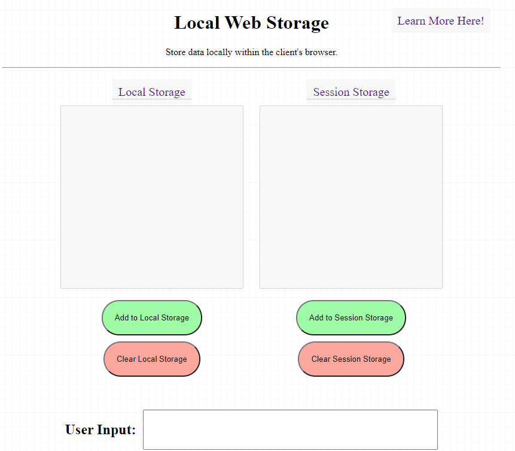

# Local Web Storage

Local Web Storage enables you to store data locally within the clients's browser.

There are two types of web storage we can access:

1) Local Storage - Does not expire and must be cleared manually

2) Session Storage - Cleared when the page session ends

## About This Repo

This project includes Pseudo Code for a Coding Lab. The fully functioning version is located on the 'build' branch.

This is a free educational resource released under the MIT License. Use, build, and snip from this project however you like!

